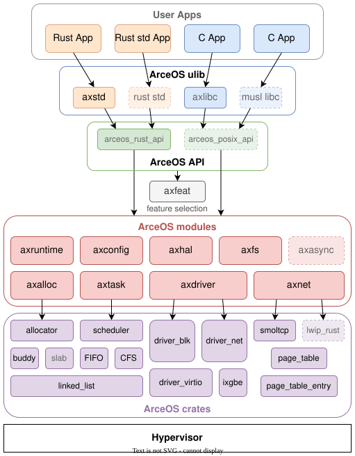

# ArceOS

[](https://github.com/rcore-os/arceos/actions/workflows/build.yml)
[](https://github.com/rcore-os/arceos/actions/workflows/test.yml)
[](https://rcore-os.github.io/arceos/)

An experimental modular operating system (or unikernel) written in Rust.

ArceOS was inspired a lot by [Unikraft](https://github.com/unikraft/unikraft).

🚧 Working In Progress.

## Features & TODOs

* [x] Architecture: x86_64, riscv64, aarch64
* [x] Platform: QEMU pc-q35 (x86_64), virt (riscv64/aarch64)
* [x] Multi-thread
* [x] FIFO/RR/CFS scheduler
* [x] VirtIO net/blk/gpu drivers
* [x] TCP/UDP net stack using [smoltcp](https://github.com/smoltcp-rs/smoltcp)
* [x] Synchronization/Mutex
* [x] SMP scheduling with single run queue
* [x] File system
* [ ] Compatible with Linux apps
* [ ] Interrupt driven device I/O
* [ ] Async I/O

## apps/bencher: GPIO on RK3588 功能

RK3588 GPIO 外设支持的核心能力如下：

* **通用 I/O 与总线接口**：GPIO 是 APB 从设备，采用 32-bit APB 数据总线，可通过内存映射寄存器控制外部引脚。
* **引脚规模与独立配置**：单个 GPIO 控制器最多支持 32 路可独立配置的信号（每 bit 对应一路信号）。
* **数据与方向控制**：
    * 通过 GPIO_SWPORT_DR_L/H 设置输出数据。
    * 通过 GPIO_SWPORT_DDR_L/H 设置方向（默认输入）。
    * 通过 GPIO_EXT_PORT 读取外部引脚电平，且与方向配置无关（只读回读）。
* **按位写掩码机制**：软件控制寄存器支持按位写掩码，可在单次写入中精确更新目标 bit，避免误改其他 bit。
* **中断功能完整**：支持每路 GPIO 作为中断源，并可配置为：
    * 高电平触发（level high）
    * 低电平触发（level low）
    * 上升沿触发（rising edge）
    * 下降沿触发（falling edge）
    * 双边沿触发（both edge）
* **中断屏蔽与状态观测**：
    * GPIO_INT_MASK_L/H 用于屏蔽。
    * GPIO_INT_RAWSTATUS 可查看屏蔽前状态。
    * GPIO_INT_STATUS 可查看屏蔽后状态。
    * 边沿中断可通过 GPIO_PORT_EOI_L/H 写 1 清除。
* **去抖（Debounce）支持**：可对输入中断信号启用去抖，支持外部慢时钟或内部分频时钟；通过 GPIO_DEBOUNCE_L/H、GPIO_DBCLK_DIV_EN_L/H、GPIO_DBCLK_DIV_CON 配置。
* **中断与方向的约束关系**：GPIO 用作中断输入时应配置为输入；若改为输出，新中断不会继续产生（且电平中断会丢失）。
* **时钟同步要求**：中断检测与 pclk_intr（连接 APB pclk）同步，故中断检测依赖 pclk 正常运行。
* **虚拟化双 OS 模型**：
    * 使能 GPIO_VIRTUAL_EN 后，可将寄存器访问与中断能力分配给两个虚拟 OS（OS_A 使用原偏移，OS_B 使用 +0x1000 偏移）。
    * 可通过 GPIO_REG_GROUP_L/H（文档中也称 GPIO_GPIO_REG_GROUP_L/H）对 32 路 GPIO 进行归属划分。
* **非虚拟模式下双中断用途**：即使不启用虚拟化，也可利用分组实现两路独立中断，用于优先级策略。
* **多控制器实例**：RK3588 共有 5 组 GPIO（GPIO0 位于 PD_PMU；GPIO1~GPIO4 位于 PD_BUS），寄存器组结构一致、基地址不同。

### GPIO 寄存器总表

| Name | Offset | Size | Reset Value | Description |
| - | - | - | - | - |
| GPIO_SWPORT_DR_L | 0x0000 | W | 0x00000000 | 低 16 位端口输出数据寄存器 |
| GPIO_SWPORT_DR_H | 0x0004 | W | 0x00000000 | 高 16 位端口输出数据寄存器 |
| GPIO_SWPORT_DDR_L | 0x0008 | W | 0x00000000 | 低 16 位端口方向控制寄存器 |
| GPIO_SWPORT_DDR_H | 0x000C | W | 0x00000000 | 高 16 位端口方向控制寄存器 |
| GPIO_INT_EN_L | 0x0010 | W | 0x00000000 | 低 16 位中断使能寄存器 |
| GPIO_INT_EN_H | 0x0014 | W | 0x00000000 | 高 16 位中断使能寄存器 |
| GPIO_INT_MASK_L | 0x0018 | W | 0x00000000 | 低 16 位中断屏蔽寄存器 |
| GPIO_INT_MASK_H | 0x001C | W | 0x00000000 | 高 16 位中断屏蔽寄存器 |
| GPIO_INT_TYPE_L | 0x0020 | W | 0x00000000 | 低 16 位中断类型（电平/边沿）寄存器 |
| GPIO_INT_TYPE_H | 0x0024 | W | 0x00000000 | 高 16 位中断类型（电平/边沿）寄存器 |
| GPIO_INT_POLARITY_L | 0x0028 | W | 0x00000000 | 低 16 位中断极性寄存器 |
| GPIO_INT_POLARITY_H | 0x002C | W | 0x00000000 | 高 16 位中断极性寄存器 |
| GPIO_INT_BOTHEDGE_L | 0x0030 | W | 0x00000000 | 低 16 位双边沿中断控制寄存器 |
| GPIO_INT_BOTHEDGE_H | 0x0034 | W | 0x00000000 | 高 16 位双边沿中断控制寄存器 |
| GPIO_DEBOUNCE_L | 0x0038 | W | 0x00000000 | 低 16 位去抖使能寄存器 |
| GPIO_DEBOUNCE_H | 0x003C | W | 0x00000000 | 高 16 位去抖使能寄存器 |
| GPIO_DBCLK_DIV_EN_L | 0x0040 | W | 0x00000000 | 低 16 位去抖分频时钟使能寄存器 |
| GPIO_DBCLK_DIV_EN_H | 0x0044 | W | 0x00000000 | 高 16 位去抖分频时钟使能寄存器 |
| GPIO_DBCLK_DIV_CON | 0x0048 | W | 0x00000001 | 去抖时钟分频系数寄存器 |
| GPIO_INT_STATUS | 0x0050 | W | 0x00000000 | 中断状态寄存器（屏蔽后） |
| GPIO_INT_RAWSTATUS | 0x0058 | W | 0x00000000 | 中断原始状态寄存器（屏蔽前） |
| GPIO_PORT_EOI_L | 0x0060 | W | 0x00000000 | 低 16 位边沿中断清除寄存器 |
| GPIO_PORT_EOI_H | 0x0064 | W | 0x00000000 | 高 16 位边沿中断清除寄存器 |
| GPIO_EXT_PORT | 0x0070 | W | 0x00000000 | 外部端口输入电平读取寄存器 |
| GPIO_VER_ID | 0x0078 | W | 0x0101157C | GPIO 版本 ID 寄存器 |
| GPIO_GPIO_REG_GROUP_L | 0x0100 | W | 0x00000000 | 低 16 位 GPIO 分组/归属控制寄存器 |
| GPIO_GPIO_REG_GROUP_H | 0x0104 | W | 0x0000FFFF | 高 16 位 GPIO 分组/归属控制寄存器 |
| GPIO_GPIO_VIRTUAL_EN | 0x0108 | W | 0x00000000 | GPIO 虚拟化（双 OS）使能寄存器 |

## Example apps

Example applications can be found in the [apps/](apps/) directory. All applications must at least depend on the following modules, while other modules are optional:

* [axruntime](modules/axruntime/): Bootstrapping from the bare-metal environment, and initialization.
* [axhal](modules/axhal/): Hardware abstraction layer, provides unified APIs for cross-platform.
* [axconfig](modules/axconfig/): Platform constants and kernel parameters, such as physical memory base, kernel load addresses, stack size, etc.
* [axlog](modules/axlog/): Multi-level formatted logging.

The currently supported applications (Rust), as well as their dependent modules and features, are shown in the following table:

| App | Extra modules | Enabled features | Description |
|-|-|-|-|
| [helloworld](apps/helloworld/) | | | A minimal app that just prints a string |
| [exception](apps/exception/) | | paging | Exception handling test |
| [memtest](apps/memtest/) | axalloc | alloc, paging | Dynamic memory allocation test |
| [display](apps/display/) | axalloc, axdisplay | alloc, paging, display | Graphic/GUI test |
| [yield](apps/task/yield/) | axalloc, axtask | alloc, paging, multitask, sched_fifo | Multi-threaded yielding test |
| [parallel](apps/task/parallel/) | axalloc, axtask | alloc, paging, multitask, sched_fifo | Parallel computing test (to test synchronization & mutex) |
| [sleep](apps/task/sleep/) | axalloc, axtask | alloc, paging, multitask, sched_fifo | Thread sleeping test |
| [shell](apps/fs/shell/) | axalloc, axdriver, axfs | alloc, paging, fs | A simple shell that responds to filesystem operations |
| [httpclient](apps/net/httpclient/) | axalloc, axdriver, axnet | alloc, paging, net | A simple client that sends an HTTP request and then prints the response |
| [echoserver](apps/net/echoserver/) | axalloc, axdriver, axnet, axtask | alloc, paging, net, multitask | A multi-threaded TCP server that reverses messages sent by the client  |
| [httpserver](apps/net/httpserver/) | axalloc, axdriver, axnet, axtask | alloc, paging, net, multitask | A multi-threaded HTTP server that serves a static web page |

## Build & Run

### Install build dependencies

Install [cargo-binutils](https://github.com/rust-embedded/cargo-binutils) to use `rust-objcopy` and `rust-objdump` tools:

```bash
cargo install cargo-binutils
```

#### for build&run C apps
Install `libclang-dev`:

```bash
sudo apt install libclang-dev
```

Download&Install `cross-musl-based toolchains`:
```
# download
wget https://musl.cc/aarch64-linux-musl-cross.tgz
wget https://musl.cc/riscv64-linux-musl-cross.tgz
wget https://musl.cc/x86_64-linux-musl-cross.tgz
# install
tar zxf aarch64-linux-musl-cross.tgz
tar zxf riscv64-linux-musl-cross.tgz
tar zxf x86_64-linux-musl-cross.tgz
# exec below command in bash OR add below info in ~/.bashrc
export PATH=`pwd`/x86_64-linux-musl-cross/bin:`pwd`/aarch64-linux-musl-cross/bin:`pwd`/riscv64-linux-musl-cross/bin:$PATH
```

### Dependencies for running apps

```bash
# for Debian/Ubuntu
sudo apt-get install qemu-system
```

```bash
# for macos
brew install qemu
```
other systems and arch please refer to [Qemu Download](https://www.qemu.org/download/#linux)

### Example apps

```bash
# build app in arceos directory
make A=path/to/app ARCH=<arch> LOG=<log>
```

Where `<arch>` should be one of `riscv64`, `aarch64`，`x86_64`.

`<log>` should be one of `off`, `error`, `warn`, `info`, `debug`, `trace`.

`path/to/app` is the relative path to the example application.

More arguments and targets can be found in [Makefile](Makefile).

For example, to run the [httpserver](apps/net/httpserver/) on `qemu-system-aarch64` with 4 cores:

```bash
make A=apps/net/httpserver ARCH=aarch64 LOG=info SMP=4 run NET=y
```

Note that the `NET=y` argument is required to enable the network device in QEMU. These arguments (`BLK`, `GRAPHIC`, etc.) only take effect at runtime not build time.

### Your custom apps

#### Rust

1. Create a new rust package with `no_std` and `no_main` environment.
2. Add `axstd` dependency and features to enable to `Cargo.toml`:

    ```toml
    [dependencies]
    axstd = { path = "/path/to/arceos/ulib/axstd", features = ["..."] }
    ```

3. Call library functions from `axstd` in your code, just like the Rust [std](https://doc.rust-lang.org/std/) library.
4. Build your application with ArceOS, by running the `make` command in the application directory:

    ```bash
    # in app directory
    make -C /path/to/arceos A=$(pwd) ARCH=<arch> run
    # more args: LOG=<log> SMP=<smp> NET=[y|n] ...
    ```

    All arguments and targets are the same as above.

#### C

1. Create `axbuild.mk` and `features.txt` in your project:

    ```bash
    app/
    ├── foo.c
    ├── bar.c
    ├── axbuild.mk      # optional, if there is only one `main.c`
    └── features.txt    # optional, if only use default features
    ```

2. Add build targets to `axbuild.mk`, add features to enable to `features.txt` (see this [example](apps/c/sqlite3/)):

    ```bash
    # in axbuild.mk
    app-objs := foo.o bar.o
    ```

    ```bash
    # in features.txt
    alloc
    paging
    net
    ```

3. Build your application with ArceOS, by running the `make` command in the application directory:

    ```bash
    # in app directory
    make -C /path/to/arceos A=$(pwd) ARCH=<arch> run
    # more args: LOG=<log> SMP=<smp> NET=[y|n] ...
    ```

### How to build ArceOS for specific platforms and devices

Set the `PLATFORM` variable when run `make`:

```bash
# Build helloworld for raspi4
make PLATFORM=aarch64-raspi4 A=apps/helloworld
```

You may also need to select the corrsponding device drivers by setting the `FEATURES` variable:

```bash
# Build the shell app for raspi4, and use the SD card driver
make PLATFORM=aarch64-raspi4 A=apps/fs/shell FEATURES=driver-bcm2835-sdhci
# Build Redis for the bare-metal x86_64 platform, and use the ixgbe and ramdisk driver
make PLATFORM=x86_64-pc-oslab A=apps/c/redis FEATURES=driver-ixgbe,driver-ramdisk SMP=4
```

## Design


